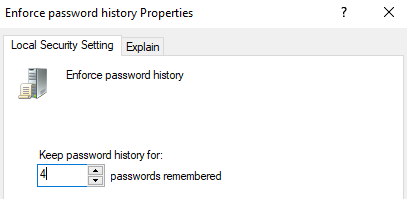
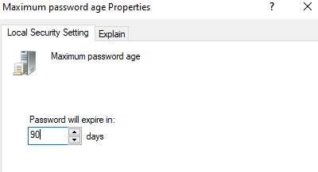
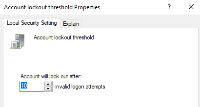
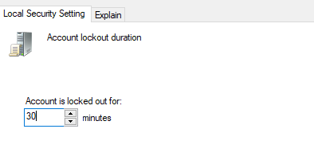
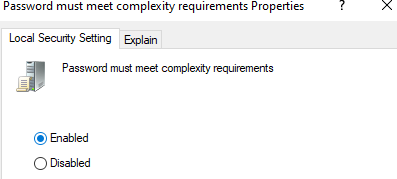

# 🔐 PCI DSS Password Policy Audit Lab (Windows 10 VM)

This lab simulates a real-world internal PCI DSS v4.0.1 audit focused on password policy validation and enforcement.  
As an Internal Security Assessor (ISA), I performed a walkthrough of a Windows 10 virtual machine to validate compliance with Requirement 8.

---

## 👤 Role

- **Auditor:** Alex Bolden, Internal Security Assessor (ISA)  
- **System Owner:** Stone Cold Steve Austin – IT Lead  
- **Target System:** Windows 10 Standalone VM (Non-Domain Joined)  
- **Audit Period:** June 2025  

---

## 📋 Internal PCI DSS Password Policy Audit Report

**Confidential – For Internal Use Only**

- **Organization:** Google.com  
- **System Owner:** Stone Cold Steve Austin - IT Lead  
- **Audit Performed By:** Alex Bolden– Internal PCI Auditor  
- **Audit Date:** June 2025  
- **Target System:** Windows 10 Standalone VM  

---

### Executive Summary

This audit report presents the results of an internal assessment of the password authentication policies configured on a Windows 10 virtual machine used for PCI-related administrative functions.

The goal was to validate compliance with **PCI DSS v4.0.1 Requirement 8**. The assessment revealed multiple deficiencies in system configuration — most notably in password length, complexity, expiration, lockout thresholds, and temporary password handling.

---

### System Design Description

The target system is a Windows 10 standalone VM simulating access to cardholder data. It is configured using local security policy (`secpol.msc`) and does not rely on domain-joined group policies. Local user accounts are used to validate enforcement of password and account lockout policies.

System changes are applied manually and validated using PowerShell and command-line tools.

---

### Observations

During the audit, it was noted that several password-related controls were misconfigured. Key observations include:

- Password length set below PCI minimum  
- Complexity settings disabled  
- Expiration and reuse policies misaligned with standards  
- Lockout thresholds too lenient  
- No enforcement for temp password reset  
- No documented configuration standard or user password guidance was provided  

---

### Audit Findings

| Finding # | Description | PCI DSS Requirement | Risk | Recommendation | Due Date |
|-----------|-------------|---------------------|------|----------------|----------|
| 8.01 | Password minimum length is set to 8 characters | 8.3.6 | Susceptible to brute-force attacks | Set password length to 12 characters | 2025-06-20 |
| 8.02 | Password complexity is disabled | 8.3.7 | Allows weak passwords with low entropy | Enable complexity: uppercase, lowercase, number, special character | 2025-06-20 |
| 8.03 | Password expiration set to 180 days | 8.3.8 | Extended expiration increases exposure | Reduce to 90-day expiration per PCI DSS | 2025-06-20 |
| 8.04 | Only 1 password remembered | 8.3.9 | Allows password cycling | Remember last 4 passwords | 2025-06-20 |
| 8.05 | Lockout threshold set to 20 attempts | 8.3.11 | Increased brute-force risk | Lower to 10 failed attempts | 2025-06-20 |
| 8.06 | Lockout duration only 5 minutes | 8.3.12 | Resets too quickly for protection | Set to 30 minutes or manual reset | 2025-06-20 |
| 8.07 | Temporary passwords don’t expire | 8.3.13 | Long-lived temp access risk | Enforce 24-hour expiry + reset at login | 2025-06-20 |

---

### Remediation Plan

The System Owner is responsible for applying the above recommendations by **June 20, 2025**.  
Changes can be made via `secpol.msc` or GPO.

A follow-up validation audit will be performed after the deadline. All remediated controls must be evidenced with screenshots and timestamped confirmation.

---

### Conclusion

This internal audit has identified multiple deviations from PCI DSS Requirement 8. A formal remediation effort is required to address the gaps before the system can be marked compliant.

Once changes are implemented, a compliance verification walkthrough will confirm closure of each finding.

---

## 🔍 Assessor Interview & Evidence Log

| PCI Req | Interview Question | Screenshot |
|---------|--------------------|------------|
| **8.3.7** | Can you show that users cannot reuse any of their last 4 passwords? |  |
| **8.3.8** | Where is your documented guidance on password creation, reuse, and reporting? | _(Jira ticket or SharePoint entry pending)_ |
| **8.3.9** | Can you show that passwords are configured to expire every 90 days? |  |
| **8.3.4** | What happens after 10 failed login attempts? And how long is the lockout duration? |   |
| **8.6.3** | How do you ensure passwords are constructed with complexity appropriate to their usage? |  |

---

## 🖼️ Screenshot Evidence

Screenshots are split into folders:

- [`screenshots_pre/`](./screenshots_pre) – Before remediation  
- [`screenshots_post/`](./screenshots_post) – After remediation  

Each screenshot is named after the PCI requirement or system setting being validated. All images are embedded directly above in the Interview Table for visual clarity.

---

## 🛠️ Remediation Summary

All misconfigurations were remediated by the IT Lead. Screenshots reflect updated policies enforced through `secpol.msc`.

Each remediation aligns directly with the internal audit findings documented earlier in this repo.

---

## ✅ Compliance Conclusion

The target system now meets PCI DSS v4.0.1 Requirement 8 password policy expectations.  
A full remediation walkthrough, interview log, and evidence chain have been provided for validation and audit readiness.

