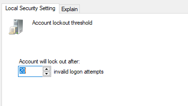

🔍 Password Policy Validation – Interview & Evidence Log

This document simulates a real-world PCI DSS v4.0 password policy audit, structured from the perspective of an Internal Security Assessor (ISA). The ISA does not apply system changes but instead requests that the IT Lead (Stone Cold Steve Austin) demonstrate compliance settings, which are then captured as evidence.

---

## 🧑‍💼 Interview Questions and Evidence Collection

As the ISA, I requested evidence for each PCI DSS v4.0 Requirement 8 password control. Screenshots were taken during the session to verify what the IT Lead showed.

### ✅ Pre-Remediation Questions and Screenshots

| PCI Req | Assessor Question | Screenshot |
|---------|-------------------|------------|
| 8.2.6   | Can you show me your password configuration standard? | *(Refer to SharePoint entry – not available)* |
| 8.3.1   | Can you pull up the minimum password length setting? |  |
| 8.3.5   | Can you show me how many previous passwords are remembered? |  |
| 8.3.6   | Where can I verify that password complexity is enabled? |  |
| 8.3.7   | Please show me the password expiration setting (in days). |  |
| 8.3.9   | Can you show me your account lockout threshold? |  |
| 8.3.9   | Can you show me lockout duration and reset time settings? |  |
| -       | Show me 'net accounts' CLI output for global policy confirmation. |  |
| -       | Can you show me PasswordLastSet date from CLI? |  |

---

### 🛠️ Post-Remediation Validation and Follow-Up

| PCI Req | Follow-Up Question | Screenshot |
|---------|--------------------|------------|
| 8.2.6   | Was the configuration standard updated after changes? | *(Pending update to SharePoint)* |
| 8.3.1   | Please show me updated password length setting. |  |
| 8.3.5   | Please show me updated password history setting. |  |
| 8.3.6   | Can you show complexity settings again for confirmation? |  |
| 8.3.7   | Show password expiration setting after remediation. |  |
| 8.3.9   | Can you show lockout threshold and duration again? |   |
| -       | Show me updated 'net accounts' CLI output. |  |

---

## 📝 Notes

- All settings were demonstrated by the IT Lead and validated visually.
- Screenshots were captured as part of the audit session.
- IT Lead confirmed remediation changes were submitted via Jira ticket #4569.

